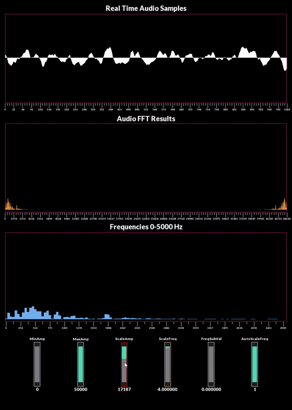

# Audio Visualizer
Audio Visualizer with FFT (Fast Fourier Transform), written in  C++. Code implementation of the Cooley-Tukey FFT algorithm. SFML library was used for audio input and visualization.
## Example 1. Various Sound Waves

## Example 2. Music

